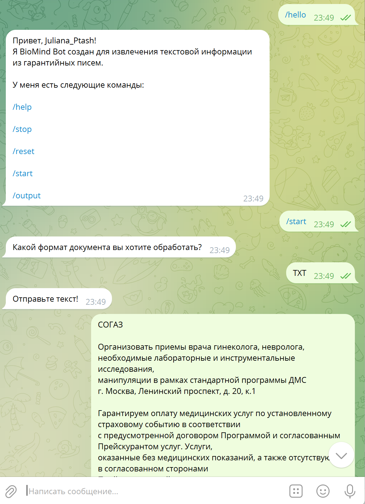

<a name="readme-top"></a>
[](https://python.org/)
[](https://github.com/psf/black)

<!-- Библиотеки проекта -->
[](https://github.com/eternnoir/pyTelegramBotAPI)
[](https://www.sqlite.org/index.html)
[](#)
[](#)
[](https://docs.python.org/3/library/datetime.html)

<h1 align="center">Модель предсказания услуг "Медси" для страховых писем</h1>

<!-- Содержание -->
<details>
  <summary>Содержание</summary>
  <ol>
    <li>
      <a href="#подготовка-датасета-для-обучения">Подготовка датасета для обучения</a>  
    </li>
    <li>
      <a href="#обучение-моделей">Обучение моделей</a>  
    </li>
    <li>
      <a href="#использование-моделей">Использование моделей</a>  
    </li>
    <li>
      <a href="#biomind-bot">BioMind bot</a>
      <ul>
        <li><a href="#запуск-чатбота-в-telegram">Запуск чатбота в Telegram</a></li>
        <li>
          <a href="#основные-команды-чатбота">Основные команды чатбота</a>
        </li>
      </ul>
    </li>
  </ol>
</details>

## Подготовка датасета для обучения
В первую очередь требуется подгтотовить датасет для обучения моделей. Исходный датасет содержит очень мало данных, поэтому нужно применить методы аугментации текста, чтобы получить подходящее количество данных. Ноутбук [Preprocessing_datasets.ipynb](Preprocessing_datasets.ipynb) содержит код преобразования исходного датасета в требуемый.

## Обучение моделей
Страховые письма глобально бывают двух видов - содержащие услуги и не содержащие услуг. Первые, в свою очередь, классифицируются на конкретный перечень услуг, указанный в справочнике из 75 элементов. Чтобы максимально точно поддержать требуемую иерархию, было принято решение обучить 2 модели - бинарную и мультиклассовую.

Код для обучения бинарной модели представлен в ноутбуке [train_binary_model.ipynb](train_binary_model.ipynb). Для обучения использовался аугментированный датасет [`final_aug_df.csv`](datasets/final_aug_df.csv).

Код для обучения мультиклассовой модели можно посмотреть в ноутбуке [train_multiclass_model.ipynb](train_multiclass_model.ipynb). Для обучения использовался аугментированный датасет [`multiclass_df.csv`](datasets/multiclass_df.csv).

Предобученные сохраненные модели можно найти в каталоге `models`.

## Использование моделей
Для удобства использования бинарной модели был написан класс [BertBinaryClassifier](bert_binary_classifier.py), который загружает предобученную модель и имеет метод `predict`, получающий на вход текстовую строку и возвращающий метку класса - 0 или 1:

```python
from bert_binary_classifier import BertBinaryClassifier

binary_classifier = BertBinaryClassifier()
prediction = binary_classifier.predict('Some text')
```

Для работы с мультиклассовой моделью требуется 2 класса: [DistilBERTClass](distilbert_class.py) (базовый класс, наследуется из PyTorch) и [BertMulticlassClassifier](bert_multiclass_classifier.py), который имеет метод `predict`, возвращающий массив из 75 элементов, в которых позиция числа 1 соответствует коду (от 0 до 74) оказываемой услуги:

```python
from distilbert_class import DistilBERTClass
from bert_multiclass_classifier import BertMulticlassClassifier

multiclass_classifier = BertMulticlassClassifier()
predictions = multiclass_classifier.predict('Some text')
```

<!-- BIOMIND BOT -->
## BioMind bot
BioMind Bot - это чат-бот для Telegram, разработанный для больничной сети "Медси" с целью автоматизации процесса обработки гарантийных писем от страховых компаний. Применяемая нейросеть способна анализировать текстовые документы, выявлять ключевую информацию о медицинских услугах.

Чатбот позволяет вести беседы примерно такого вида:



### Запуск чатбота в Telegram

По ссылке можно получить доступ к чатботу : [@biomind_bot](https://t.me/biomind_bot)

Введите команду */hello*, чтобы начать диалог с ботом.

<!-- ОСНОВНЫЕ КОМАНДЫ ЧАТБОТА -->
### Основные команды чатбота
- /help - описание проекта, ссылка на github, выход в главное меню;
- /reset - удаляет все записи в базе данных пользователя и завершает работу;
- /start - выводит кнопки для пользователя (TXT, PDF, DOCX), чтобы пользователь выбрал формат файла, который он хочет обработать.
- /output - выводит всю информацию по обработанным письмам для пользователя. (максимум 3 записи, самая старая запись удаляется)
