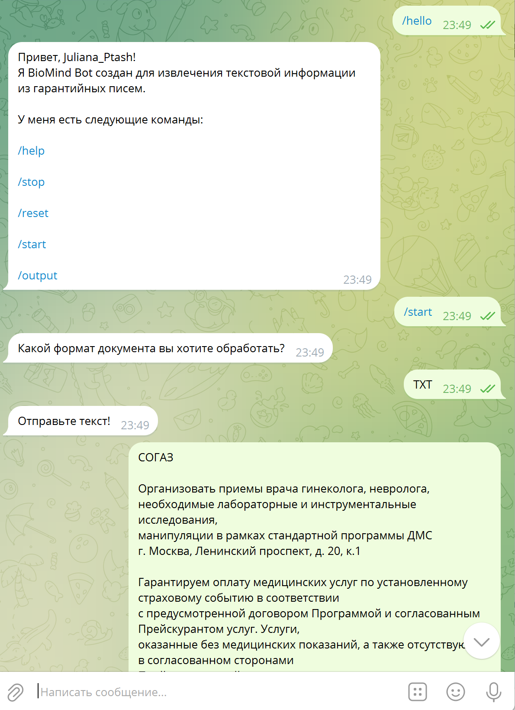

<!-- Библиотеки проекта -->

<h1 align="center">BioMind chat-bot</h1>

<!-- Содержание -->

  
Содержание

  <ol>
    <li>
      <a href="#описание">Описание</a>
      <ul>
        <li><a href="#запуск-чатбота-в-telegram">Запуск чатбота в Telegram</a></li>
      </ul>
    </li>
    <li>
      <a href="#основные-команды-чатбота">Основные команды чатбота</a>
    </li>
  </ol>

<!-- ОПИСАНИЕ -->
## Описание
BioMind Bot - это чат-бот для Telegram, разработанный для больничной сети "Медси" с целью автоматизации процесса обработки гарантийных писем от страховых компаний. Применяемая нейросеть способна анализировать текстовые документы, выявлять ключевую информацию о медицинских услугах.

Чатбот позволяет вести беседы примерно такого вида:

### Запуск чатбота в Telegram

По ссылке можно получить доступ к чатботу : [@biomind_bot](https://t.me/biomind_bot)

Введите команду */hello*, чтобы начать диалог с ботом.

<!-- ОСНОВНЫЕ КОМАНДЫ ЧАТБОТА -->
## Основные команды чатбота
- /help - описание проекта, ссылка на github, выход в главное меню;
- /reset - удаляет все записи в базе данных пользователя и завершает работу;
- /start - выводит кнопки для пользователя (TXT, PDF, DOCX), чтобы пользователь выбрал формат файла, который он хочет обработать.
- /output - выводит всю информацию по обработанным письмам для пользователя. (максимум 3 записи, самая старая запись удаляется)
